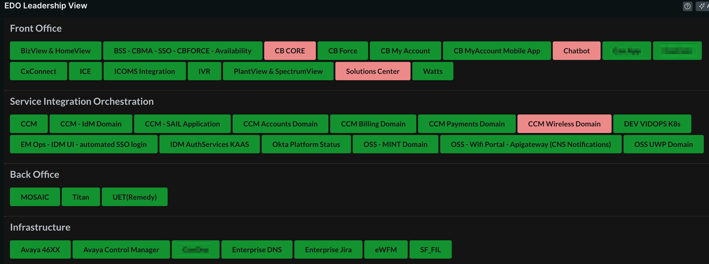
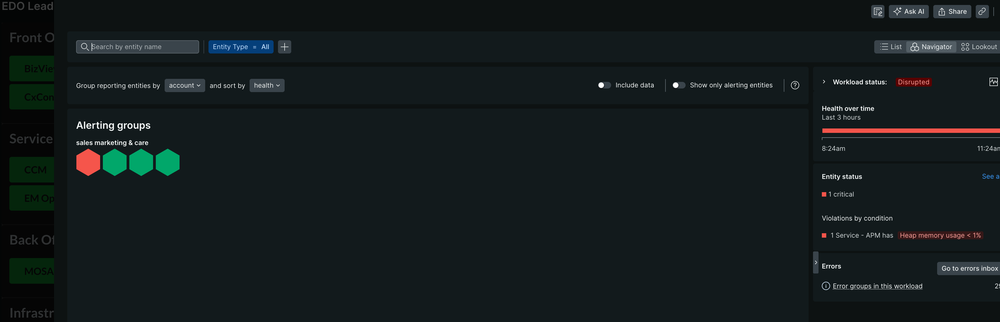

# Workload Leadership View

This is an alternative view to Workloads/Workload Views within New Relic, that is more simple/management friendly.

## Pre-requirements

* Workload of workloads - A parent workload that contains child workloads, and those child workloads tagged with a useful grouping attribute (i.e - Tier,Service,Criticality)


## Configuration

Input the following into `config.json` before serving/publishing:

* parentWorkloadGuid: The guid of the parent workload entity, that contains all child workloads
* groupByTag: The tag that exists on all child workloads, for grouping.


## Example




## Getting Started

First, ensure that you have [Git](https://git-scm.com/book/en/v2/Getting-Started-Installing-Git) and [NPM](https://www.npmjs.com/get-npm) installed. If you're unsure whether you have one or both of them installed, run the following command(s) (If you have them installed these commands will return a version number, if not, the commands won't be recognized):

```bash
git --version
npm -v
```

Next, install the [NR1 CLI](https://one.newrelic.com/launcher/developer-center.launcher) by going to [this link](https://one.newrelic.com/launcher/developer-center.launcher) and following the instructions (5 minutes or less) to install and setup your New Relic development environment.

Next, clone this repository and update `config.json` accordingly. To run the code locally against your New Relic data, execute the following commands:

```bash
cd nr1-leadership-view
npm install
nr1 nerdpack:serve
```

Visit [https://one.newrelic.com/?nerdpacks=local](https://one.newrelic.com/?nerdpacks=local), navigate to the Nerdpack, and :sparkles:

## Deploying this Nerdpack

Open a command prompt in the nerdpack's directory and run the following commands.

```bash
# To create a new uuid for the nerdpack so that you can deploy it to your account:
# nr1 nerdpack:uuid -g [--profile=your_profile_name]

# To see a list of API keys / profiles available in your development environment:
# nr1 profiles:list

nr1 nerdpack:publish [--profile=your_profile_name]
nr1 nerdpack:subscribe [-c [DEV|BETA|STABLE]] [--profile=your_profile_name]
```

Visit [https://one.newrelic.com](https://one.newrelic.com), navigate to the Nerdpack, and :sparkles:
